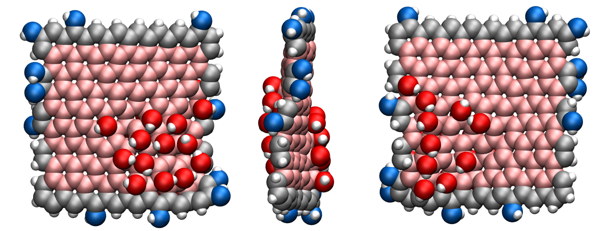

# Graphene Oxide Nanoparticle #

This repository is a bank of Graphene Oxide (GO) nanoparticles generated using [make-graphitics](https://github.com/velocirobbie/make-graphitics). GO particles are square with lateral size L from 1.2 to 2.8 nm. Carbon atoms are functionalised hydroxyl groups only.

Folders are in the format Lx_OCy_OHz, where L refers to the lateral size of the GO particle, OC refers to the oxygen over carbon atom ratio at the basal plane of the GO particle, and OH to the hydrogen over oxygen ratio at the edge of the particle.

Each folder contains 50 subfolders, each containing the data necessary to generate a GO particle (atoms positions, bonds, angles, dihedrals, impropers), as well as a ff folder that contains the force field information (masses, bonds, angles, dihedrals, and impropers parameters). These data can be easily converted to be used with LAMMPS.

The image below shows a GO particle with OH = 0.3 and OC = 0.17. Edge carbons atoms are in gray and basal carbon atoms in pinks. Oxygen atoms attached to edge carbon atoms are in blue and oxygen atoms attached to a basal carbon atoms are in pinks. Hydrogen atoms are in white.

Visit the page of [Robert Sinclair](https://github.com/velocirobbie) for more information.
